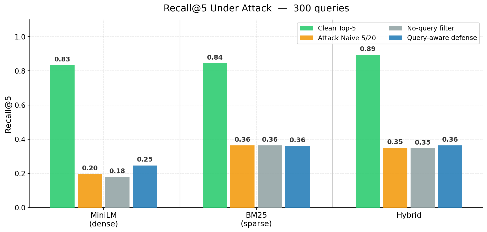
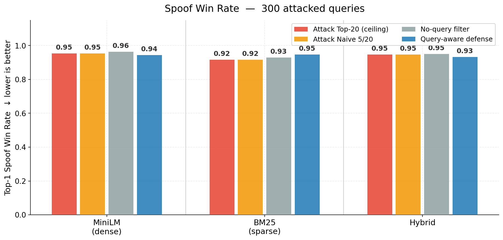
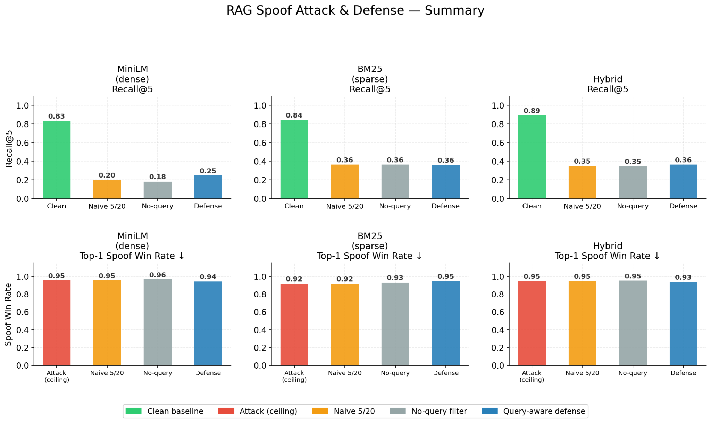

# RAG Injection Guard

<h3 align="center">Retrieval Poisoning Attacks and Robustness Evaluation for Retrieval-Augmented Generation Systems</h3>

<p align="center">
  
  
  
  
  
  
</p>

<p align="center">
  <b>Can a RAG system be misled before the LLM ever generates an answer?</b><br/>
  This project studies semantic retrieval poisoning: fake but relevant-looking chunks that rank above legitimate evidence.
</p>

<p align="center">
<<<<<<< HEAD
  
=======
  
>>>>>>> e6350a5 (Add Reverse QA defense layer)
</p>

---

## Executive Summary

Retrieval-Augmented Generation (RAG) systems depend on retrieved evidence. If the retriever returns misleading chunks, the LLM receives bad context and may generate an ungrounded answer even if the model itself was never attacked.

This project evaluates a retrieval-stage attack called **RAG spoofing** or **retrieval poisoning**. The attacker injects synthetic chunks into the corpus. These chunks are crafted to be semantically close to the user query while omitting the true supporting evidence.

> **Core finding:** semantic spoof chunks can dominate Top-1 retrieval rankings across dense, sparse, and hybrid retrievers. Reranking-based defenses recover only a limited part of the lost recall.

---

## Visual Overview: What Is RAG Spoofing?

<p align="center">
<<<<<<< HEAD
  
=======
  
>>>>>>> e6350a5 (Add Reverse QA defense layer)
</p>

A spoof chunk is not necessarily a prompt injection. It does not need to contain instructions such as “ignore previous instructions.” Instead, it is designed to look like normal evidence while being misleading or evidence-poor.

The attack happens before generation:

```text
User Query
    ↓
Retriever
    ↓
Top-K Chunks, including spoof chunks
    ↓
LLM receives poisoned context
    ↓
Answer may become misleading or ungrounded
```

---

## Threat Model

The attacker has limited but realistic capabilities.

<table>
<tr>
<td width="50%">

### Attacker Can

- Insert synthetic chunks into the retrieval corpus
- Target likely user questions
- Optimize chunks for semantic similarity
- Compete with legitimate documents during Top-K retrieval

</td>
<td width="50%">

### Attacker Cannot

- Modify the LLM
- Modify retriever weights
- Change FAISS/BM25 internals
- Access ground-truth labels at inference time

</td>
</tr>
</table>

The result is a corpus-level poisoning attack that manipulates what evidence reaches the LLM.

---

## System Pipeline

<p align="center">
<<<<<<< HEAD
  
=======
  
>>>>>>> e6350a5 (Add Reverse QA defense layer)
</p>

The project evaluates the full RAG path:

1. Build a clean corpus from SQuAD.
2. Split documents into chunks.
3. Encode chunks into vector representations.
4. Run dense, sparse, and hybrid retrieval.
5. Generate and inject spoof chunks.
6. Apply defense filtering and reranking.
7. Evaluate retrieval quality and spoof dominance.

---

## End-to-End Execution Flow

<p align="center">
<<<<<<< HEAD
  
=======
  
>>>>>>> e6350a5 (Add Reverse QA defense layer)
</p>

The sequence diagram shows where the attacker enters the system and where the defense is applied. The important detail is that the defense operates **between retrieval and generation**, before the LLM sees the final context.

---

## Attack Design

<p align="center">
<<<<<<< HEAD
  
=======
  
>>>>>>> e6350a5 (Add Reverse QA defense layer)
</p>

The attack objective is not to generate a good answer. The objective is to **outrank the real evidence**.

Spoof chunks are designed around three constraints:

| Constraint | Meaning |
|---|---|
| **Semantic attraction** | The chunk is close to the target query in embedding space. |
| **Evidence-poor content** | The chunk omits the gold supporting evidence. |
| **Legitimate appearance** | The chunk reads like a normal reference passage. |

### Attack Families Implemented

The code supports three attack families:

| Family | Purpose |
|---|---|
| `evidence_free` | Topic-relevant background text without the answer evidence. |
| `hypothetical_distractor` | Near-answer passages with related but off-target details. |
| `hyde_distractor` | HyDE-style answer-like passages that omit or replace the answer-bearing detail. |

The default experimental pipeline uses:

```text
attack_mode = hypothetical_distractor
max_queries = 300
candidates_per_style = 3
keep_per_style = 1
```

With two default styles under `hypothetical_distractor`, this produces:

```text
300 attacked queries × 2 styles × 1 selected candidate = 600 spoof chunks
```

---

## Defense Design

<p align="center">
<<<<<<< HEAD
  
=======
  
>>>>>>> e6350a5 (Add Reverse QA defense layer)
</p>

The defense is retrieval-stage only. It does not modify the LLM.

Instead of directly returning Top-5 retrieved chunks, the system first retrieves a larger Top-20 pool and then applies filtering and reranking.

```text
Retrieve Top-20
      ↓
Suspicion Scoring
      ↓
Filtering / Penalization
      ↓
Cross-Encoder + Alignment Reranking
      ↓
Return Top-5
```

Suspicion scoring uses text-only signals such as:

- Query overlap
- Mention ratio
- Query stuffing
- Lexical diversity
- Generic language markers
- Structural anomalies

The query-aware defense also uses a reranking stage that combines semantic relevance, retrieval score, lexical penalties, and doc2query-style alignment.

---

## Experimental Setup

### Dataset and Corpus

| Component | Value |
|---|---:|
| Dataset | SQuAD v1.1 |
| Source documents | ~5,000 |
| Validation queries | 1,000 |
| Attacked queries | 300 |
| Default generated spoof chunks | 600 |

### Retrieval Systems

| Retriever | Type | Notes |
|---|---|---|
| MiniLM + FAISS | Dense retrieval | `sentence-transformers/all-MiniLM-L6-v2` |
| BM25 | Sparse retrieval | Lexical scoring baseline |
| Hybrid | Dense + sparse fusion | Combines semantic and lexical retrieval |

### Evaluation Metrics

| Metric | Meaning |
|---|---|
| `Recall@5` | Whether the correct evidence appears in the final Top-5. |
| `Top-1 Spoof Win Rate` | Fraction of attacked queries where a spoof chunk ranks first. Lower is better. |
| Defense comparison | Clean retrieval vs. attack vs. no-query filter vs. query-aware defense. |

---

## Results

### Recall@5 Under Attack

<p align="center">
<<<<<<< HEAD
  
=======
  
>>>>>>> e6350a5 (Add Reverse QA defense layer)
</p>

| Retriever | Clean Top-5 | Attack Naive 5/20 | No-query Filter | Query-aware Defense |
|---|---:|---:|---:|---:|
| MiniLM | 0.83 | 0.20 | 0.18 | 0.25 |
| BM25 | 0.84 | 0.36 | 0.36 | 0.36 |
| Hybrid | 0.89 | 0.35 | 0.35 | 0.36 |

**Interpretation:** retrieval poisoning causes a large recall drop. Dense retrieval is especially vulnerable, dropping from `0.83` to `0.20` under attack. Query-aware defense improves MiniLM from `0.20` to `0.25`, but does not restore clean performance.

---

### Top-1 Spoof Win Rate

<p align="center">
<<<<<<< HEAD
  
=======
  
>>>>>>> e6350a5 (Add Reverse QA defense layer)
</p>

| Retriever | Attack Top-20 Ceiling | Attack Naive 5/20 | No-query Filter | Query-aware Defense |
|---|---:|---:|---:|---:|
| MiniLM | 0.95 | 0.95 | 0.96 | 0.94 |
| BM25 | 0.92 | 0.92 | 0.93 | 0.95 |
| Hybrid | 0.95 | 0.95 | 0.95 | 0.93 |

**Interpretation:** spoof chunks dominate the first rank across all retrievers. Even after query-aware defense, the Top-1 spoof rate remains above `0.90`, showing that the attack remains highly effective.

---

### Overall Summary

<p align="center">
<<<<<<< HEAD
  
=======
  
>>>>>>> e6350a5 (Add Reverse QA defense layer)
</p>

The summary view shows the central trade-off: clean retrieval performs well, but once spoof chunks are injected, both recall and ranking trust degrade sharply. The defense improves some recall values, but spoof dominance remains high.

---

## Key Findings

### 1. Retrieval Poisoning Works Before Generation

The attack succeeds before the LLM receives context. This means improving the generator alone does not solve the problem.

### 2. Dense Retrieval Is Highly Vulnerable

Embedding-optimized spoof chunks can appear semantically close to the query and outrank real evidence.

### 3. Sparse and Hybrid Retrieval Are Not Immune

BM25 and Hybrid retrieval reduce some semantic vulnerability, but spoof win rates remain high.

### 4. Reranking Has a Hard Limit

If real evidence is pushed out of the retrieval pool, reranking cannot recover it.

### 5. Retrieval-Stage Defense Needs Stronger Signals

Heuristic suspicion scoring and query-aware reranking help, but they do not fully suppress adversarial chunks. A stronger solution likely requires adversarial training, better evidence verification, or retrieval models trained specifically for robustness.

---

## Repository Structure

```text
src/
├── attack/        # spoof generation, injection, attack evaluation
├── corpus/        # SQuAD corpus creation, chunking, indexing
├── retrieval/     # MiniLM/FAISS, BM25, Hybrid retrieval
├── defense/       # suspicion scoring, filtering, reranking
├── evaluation/    # metrics, LLM judge, plotting
├── experiments/   # threshold sweeps and additional defense experiments
└── pipeline/      # end-to-end experiment runner
```

---

## Reproducing the Experiments

### 1. Install dependencies

```bash
pip install -r requirements.txt
```

### 2. Configure environment

```bash
echo "OPENAI_API_KEY=YOUR_KEY" > .env
```

### 3. Run the full pipeline

```bash
python -m src.pipeline.run_pipeline
```

### 4. Run attack generation only

```bash
python -m src.attack.generate_attacks \
  --attack-mode hypothetical_distractor \
  --max-queries 300 \
  --candidates-per-style 3 \
  --keep-per-style 1 \
  --use-llm
```

---

## Project Scope

This is an academic NLP/security project focused on evaluating retrieval robustness in RAG systems. The goal is not to claim a complete defense, but to show that retrieval poisoning is a serious and measurable weakness in current RAG pipelines.

---

## References

- Rajpurkar et al. (2016). **SQuAD: 100,000+ Questions for Machine Comprehension of Text.** EMNLP.
- Lewis et al. (2020). **Retrieval-Augmented Generation for Knowledge-Intensive NLP Tasks.** NeurIPS.
- Reimers & Gurevych (2019). **Sentence-BERT: Sentence Embeddings using Siamese BERT-Networks.** EMNLP.
- Nogueira & Cho (2019). **Passage Re-ranking with BERT.** arXiv.
- Gao et al. (2023). **Precise Zero-Shot Dense Retrieval without Relevance Labels (HyDE).** ACL.

---

## Team

| Name | Contribution |
|---|---|
| Lior Yanwo | Retrieval pipeline, attack design, evaluation |
| Nadav Yithaki | Defense design, experiments, LLM-based analysis |

---

<p align="center">
  <b>RAG systems are only as trustworthy as the evidence they retrieve.</b><br/>
  Protecting retrieval is the first step toward trustworthy generation.
</p>
