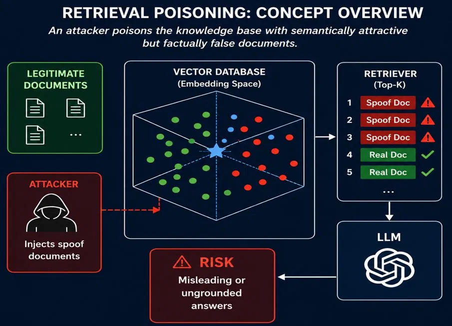
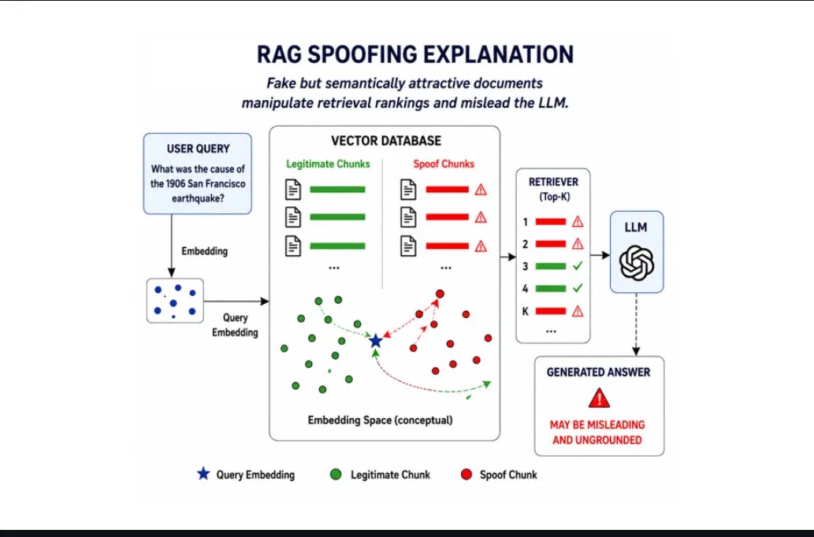
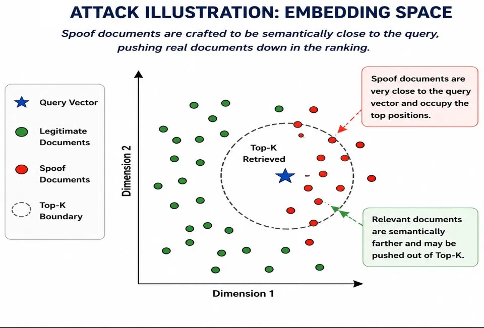
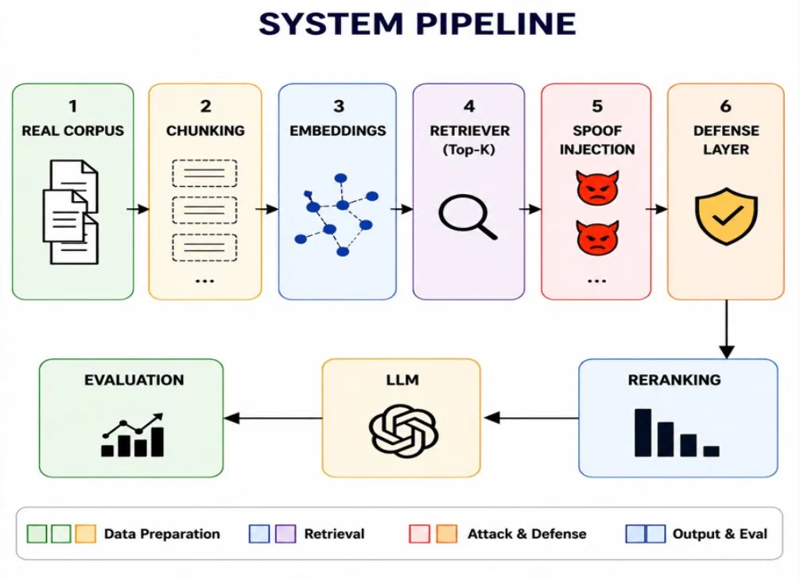
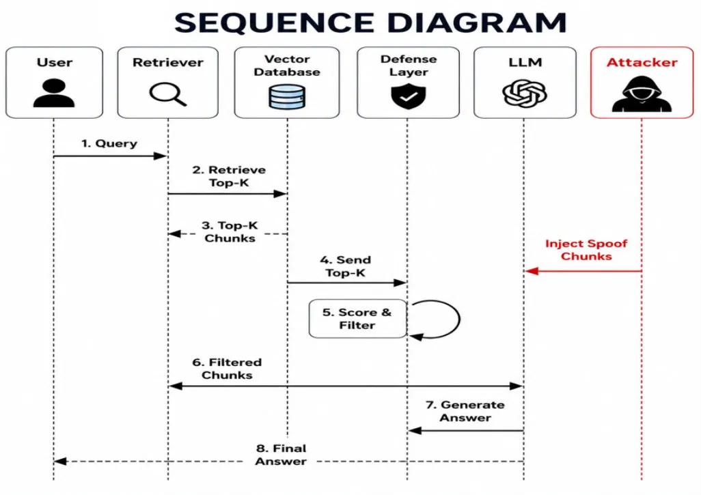
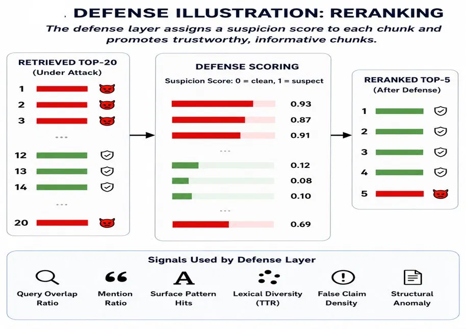
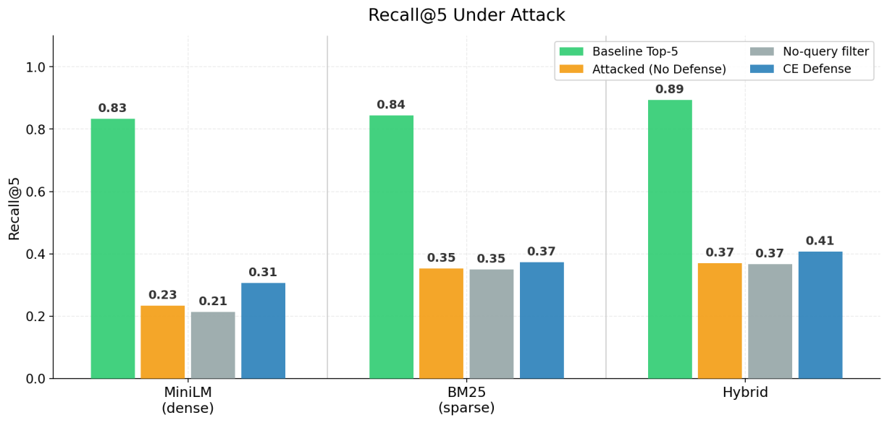
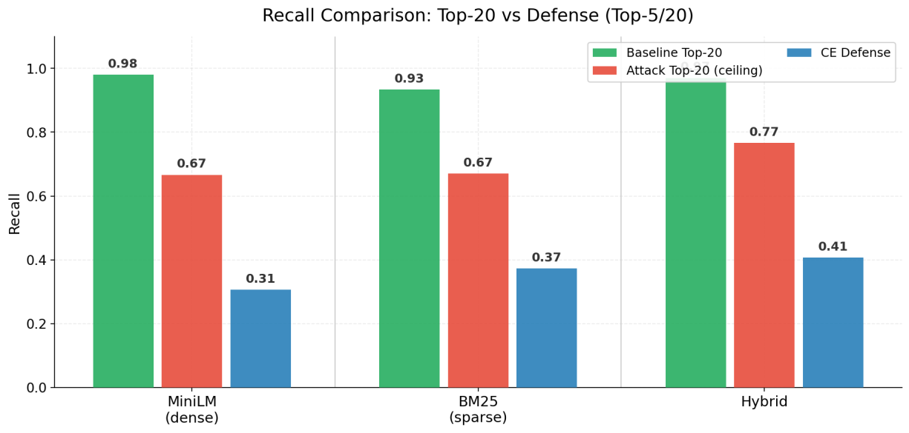

<div align="center">

# 🛡️ RAG Injection Guard

### Retrieval Poisoning Attacks & Robustness Evaluation for Retrieval‑Augmented Generation

<p>
  
  
  
  
  
  
  
</p>

<p><b>Can a RAG system be fooled <i>before</i> the LLM ever writes a single token?</b></p>

<p>This project shows that the answer is <b>yes</b> — and measures exactly how badly.<br/>
We inject synthetic chunks that <i>look</i> perfectly relevant to a query but carry <i>no real evidence</i>,<br/>
then study how dense, sparse, and hybrid retrievers — and a query‑aware defense — hold up.</p>

</div>

<p align="center">
  
</p>
---
Example: 

---

## 📑 Table of Contents

- [TL;DR](#-tldr)
- [What Is RAG Spoofing?](#-what-is-rag-spoofing)
- [Threat Model](#-threat-model)
- [System Pipeline](#-system-pipeline)
- [Attack Design](#-attack-design)
- [Defense Design](#-defense-design)
- [Experimental Setup](#-experimental-setup)
- [Results](#-results)
- [Key Findings](#-key-findings)
- [Limitations & Future Work](#-limitations--future-work)
- [Reproducing the Experiments](#-reproducing-the-experiments)
- [Repository Structure](#-repository-structure)
- [Citation](#-citation)
- [Team](#-team)

---

## ⚡ TL;DR

Retrieval‑Augmented Generation is only as trustworthy as the context it retrieves. We attack the **retrieval stage itself**: an adversary who can only *add documents to the corpus* (not touch the model or the index internals) injects chunks engineered to sit close to likely queries in embedding space while deliberately omitting the answer evidence.

The effect is dramatic and consistent across retriever families:

| | Clean Recall@5 | Recall@5 Under Attack | Top‑1 Spoof Win Rate |
|---|:---:|:---:|:---:|
| **MiniLM (dense)** | 0.83 | **0.23** | **0.96** |
| **BM25 (sparse)** | 0.84 | **0.35** | **0.95** |
| **Hybrid** | 0.89 | **0.37** | **0.96** |

> **Bottom line:** spoof chunks dominate the **#1 retrieval slot** in ~95% of attacked queries. A query‑aware Cross‑Encoder defense recovers *some* recall, but it **cannot fully undo the damage** — once real evidence is pushed out of the candidate pool, no reranker can bring it back. **LLM‑side safety alone is not enough.**

---

## 🎯 What Is RAG Spoofing?

A spoof chunk is **not** a prompt injection. It never says *"ignore previous instructions."* Instead it disguises itself as an ordinary reference passage: same topic, same vocabulary, same entities as the question — but **evidence‑poor or subtly misleading**. To a retriever it looks like exactly what the user wants; to the LLM it becomes poisoned context.

<p align="center">
  
</p>

```text
User Query
    ↓
Retriever  ──►  Top‑K chunks (now containing spoof chunks)
    ↓
LLM receives poisoned context
    ↓
Answer becomes misleading or ungrounded
```

The attack is purely **semantic**: the spoof wins on similarity, not on saying anything overtly malicious. That is what makes it hard to filter.

<p align="center">
  
</p>

> Spoof documents are crafted to land *inside* the Top‑K boundary around the query vector, displacing genuinely relevant documents toward the edge — and out of the retrieved set.

---

## 🔐 Threat Model

| The attacker **can** | The attacker **cannot** |
|---|---|
| Insert synthetic chunks into the retrieval corpus | Modify the LLM |
| Target likely user questions | Modify retriever weights |
| Optimize chunks for embedding similarity | Change FAISS / BM25 internals |
| Compete with legitimate documents during Top‑K retrieval | Access ground‑truth labels at inference time |

This is therefore a **corpus‑level retrieval‑poisoning attack** — a realistic setting for any system that ingests web pages, user uploads, wikis, or other third‑party content into its knowledge base.

---

## 🧱 System Pipeline

<p align="center">
  
</p>

The project evaluates the **entire retrieval path**, end to end:

1. **Real corpus** — build a clean corpus from SQuAD.
2. **Chunking** — split documents into overlapping passages.
3. **Embeddings** — encode chunks into dense (MiniLM / BGE‑M3) and sparse (BM25) representations.
4. **Retriever (Top‑K)** — run MiniLM, BM25, and Hybrid retrieval.
5. **Spoof injection** — generate and inject embedding‑optimized spoof chunks.
6. **Defense layer** — apply no‑query filtering or a query‑aware Cross‑Encoder reranker over a Top‑20 pool, return the final Top‑5.
7. **LLM + Evaluation** — measure recall, spoof dominance, and (optionally) LLM answer quality.

### Request lifecycle

The defense slots into the standard RAG flow without touching the model:

<p align="center">
  
</p>

---

## 💥 Attack Design

The attack objective is **not** to produce a correct answer. It is to **outrank the real evidence** while staying invisible to naive filters.

| Constraint | Meaning |
|---|---|
| **Semantic attraction** | The chunk sits close to the target query in retrieval space. |
| **Evidence‑poor content** | The chunk omits the gold supporting evidence. |
| **Legitimate appearance** | The chunk reads like a normal reference passage. |

### Embedding‑targeted generation

Spoofs are not just keyword‑stuffed — they are **selected by embedding similarity to the query**. For each query/style we generate several candidates (via `gpt-4o-mini`, with a deterministic rule‑based fallback), discard any candidate that leaks the gold answer, then keep the candidate(s) with the **highest cosine similarity to the query embedding**. This makes the attack adaptive to the retriever's own representation.

### Attack families implemented

| Family | Purpose |
|---|---|
| `evidence_free` | Topic‑relevant background text with no answer evidence. |
| `hypothetical_distractor` | Near‑answer passages carrying related but off‑target details (a nearby date, count, role, or place). |
| `hyde_attack` | HyDE‑style answer‑shaped passages that omit or swap out the answer‑bearing detail. |

**Default pipeline configuration:**

```text
attack_mode          = hypothetical_distractor
max_queries          = 300
candidates_per_style = 3      # generate
keep_per_style       = 1      # keep the most query-similar
embedding_model      = sentence-transformers/all-MiniLM-L6-v2
```

This yields **300 attacked queries** and roughly **600 optimized spoof chunks** injected into the corpus.

---

## 🛡️ Defense Design

The defense is **retrieval‑stage only** — it never modifies the LLM. Instead of returning the raw Top‑5, the system pulls a larger **Top‑20 candidate pool** and reranks it:

```text
Retrieve Top-20
      ↓
Static / no-query suspicion baseline
      ↓
Query-aware Cross-Encoder reranking
      ↓
Doc2Query / Reverse-QA alignment signal
      ↓
Return final Top-5
```

A query‑aware **suspicion score** flags retrieval‑obstruction signals — high query overlap, query stuffing, templated surface markers, low lexical diversity, generic LLM phrasing — and applies a multiplicative penalty (with hard filtering above a threshold). The Cross‑Encoder then re‑scores genuine query↔chunk relevance, and an optional Doc2Query / Reverse‑QA signal checks whether the questions a chunk *implies* actually match the user's question.

<p align="center">
  
</p>

**Three conditions are compared:**

| Condition | Meaning |
|---|---|
| **Attacked / No Defense** | Take the attacked retrieval output directly. |
| **No‑query Filter** | Static, chunk‑only filtering that never sees the user query. |
| **CE Defense** | Query‑aware Cross‑Encoder + alignment‑based reranking. |

---

## 🧪 Experimental Setup

### Dataset & corpus

| Component | Value |
|---|---:|
| Dataset | SQuAD v1.1 |
| Train examples | 5,000 |
| Validation queries | 1,000 |
| Attacked queries | 300 |
| Injected spoof chunks | ~600 |
| Chunking | 90‑word windows, 40‑word overlap |

### Retrieval systems

| Retriever | Type | Notes |
|---|---|---|
| **MiniLM + FAISS** | Dense | `sentence-transformers/all-MiniLM-L6-v2`, cosine via `IndexFlatIP` |
| **BGE‑M3 + FAISS** | Dense | `BAAI/bge-m3` |
| **BM25** | Sparse | Lexical scoring baseline (`rank_bm25`) |
| **Hybrid** | Dense + sparse | Min‑max fused dense & BM25 scores |

### Main metrics

| Metric | Meaning | Direction |
|---|---|:---:|
| `Recall@5` | Is the correct evidence in the final Top‑5? | ⬆️ higher is better |
| `Recall@20` | Is the correct evidence anywhere in the Top‑20 pool? | ⬆️ higher is better |
| `Top‑1 Spoof Win Rate` | Fraction of attacked queries where a spoof ranks **first**. | ⬇️ lower is better |

> All comparisons are made on the **same 300 attacked queries** for an apples‑to‑apples evaluation.

---

## 📊 Results

### Recall@5 under attack

<p align="center">
  
</p>

| Retriever | Clean Top‑5 | Attacked / No Defense | No‑query Filter | CE Defense |
|---|---:|---:|---:|---:|
| MiniLM | 0.83 | 0.23 | 0.21 | **0.31** |
| BM25 | 0.84 | 0.35 | 0.35 | **0.37** |
| Hybrid | 0.89 | 0.37 | 0.37 | **0.41** |

**Takeaway:** poisoning causes a large Recall@5 collapse. Dense MiniLM is hit hardest (0.83 → 0.23). The CE defense helps — most visibly on MiniLM and Hybrid — but stays well below the clean baseline.

---

### Recall: Top‑20 ceiling vs. final defended Top‑5

<p align="center">
  
</p>

| Retriever | Clean Top‑20 | Attack Top‑20 (ceiling) | CE Defense Top‑5/20 |
|---|---:|---:|---:|
| MiniLM | 0.98 | 0.67 | 0.31 |
| BM25 | 0.93 | 0.67 | 0.37 |
| Hybrid | 1.00 | 0.77 | 0.41 |

**Takeaway:** the attack doesn't merely reshuffle the Top‑5 — it pushes real evidence **out of the Top‑20 pool entirely** for many queries. Since reranking can only reorder what's already retrieved, the Attack Top‑20 column is a **hard ceiling** on any reranking defense.

---

### Top‑1 spoof win rate (attacked queries only)

<p align="center">
  
</p>

| Retriever | Attacked / No Defense | No‑query Filter | CE Defense |
|---|---:|---:|---:|
| MiniLM | 0.96 | 0.96 | 0.96 |
| BM25 | 0.95 | 0.95 | 0.94 |
| Hybrid | 0.96 | 0.97 | 0.93 |

**Takeaway:** spoofs claim the #1 rank in ~95% of attacked queries across every method. The CE defense nudges this down only slightly for BM25 and Hybrid — spoof dominance at rank 1 remains severe.

---

## 🔑 Key Findings

1. **Retrieval poisoning succeeds before generation.** The attack lands at the retrieval stage, before the LLM ever sees the context — so model‑side safety alone cannot prevent it.
2. **Dense retrieval is the most vulnerable.** MiniLM shows the sharpest Recall@5 drop (0.83 → 0.23), because semantic similarity is exactly the surface the attack optimizes for.
3. **Sparse and hybrid are not immune.** BM25 and Hybrid retain more recall, but their Top‑1 spoof win rates still exceed 0.90.
4. **Reranking helps — but has a hard limit.** The CE defense improves Recall@5, yet cannot recover evidence that the attack already evicted from the Top‑20 pool.
5. **No‑query filtering is weak.** Because spoof text is designed to look normal *in isolation*, a chunk‑only filter cannot reliably separate spoof from legitimate content — query‑aware signals are essential.

---

## 🚧 Limitations & Future Work

- **Candidate‑pool ceiling.** The strongest lever is *recall before reranking*. Future work: deeper pools, query expansion, or retrieval ensembles to keep real evidence in contention.
- **Lexical suspicion signals.** The current static/query‑aware signals are largely lexical; an adversary aware of them could adapt. Learned or contrastive spoof detectors are a natural next step.
- **Single‑hop QA.** SQuAD is single‑passage, single‑hop. Multi‑hop and long‑context RAG may behave differently under poisoning.
- **Generator‑side evaluation.** An LLM judge (`evaluate_llm.py`) measures answer correctness / support / misleadingness; tightening this into the headline metrics is ongoing.
- **No claimed complete defense.** The goal is to *measure* a real, reproducible weakness — not to declare the problem solved.

---

## ♻️ Reproducing the Experiments

### 1. Install dependencies
```bash
pip install -r requirements.txt
```

### 2. Configure environment
```bash
echo "OPENAI_API_KEY=YOUR_KEY" > .env
```

### 3. Run the full pipeline
```bash
python -m src.pipeline.run_pipeline
```

### 4. Generate spoof chunks only
```bash
python -m src.attack.generate_attacks \
  --attack-mode hypothetical_distractor \
  --max-queries 300 \
  --candidates-per-style 3 \
  --keep-per-style 1 \
  --use-llm \
  --temperature 0.9
```

### 5. Evaluate retrieval results
```bash
python -m src.evaluation.evaluate_retrieval \
  --results-path results/retrieval/minilm_attack_results.json \
  --output-path results/retrieval/minilm_attack_top20_metrics.json \
  --spoof-chunks-path data/processed/spoof_chunks.jsonl
```

### 6. Sweep the defense threshold
```bash
python -m src.defense.threshold_sweep \
  --input-path results/retrieval/minilm_attack_results.json \
  --use-doc2query
```

> **Figures:** place the project images under `assets/figures/` (filenames as referenced above) so they render in this README.

---

## 🗂️ Repository Structure

```text
src/
├── attack/        # spoof generation, injection, attack-specific metrics
├── corpus/        # SQuAD corpus creation, chunking, FAISS indexing, eval queries
├── retrieval/     # MiniLM/FAISS, BM25, Hybrid retrieval
├── defense/       # suspicion scoring, static & query-aware filtering, CE reranking, Reverse-QA, threshold sweep
├── evaluation/    # retrieval metrics, LLM judge, plotting
└── pipeline/      # end-to-end experiment runner
```

---

## 📚 Citation

If this work is useful to you, please cite it:

```bibtex
@misc{rag_injection_guard_2025,
  title  = {RAG Injection Guard: Retrieval Poisoning Attacks and Robustness
            Evaluation for Retrieval-Augmented Generation Systems},
  author = {Yanwo, Lior and Yithaki, Nadav},
  year   = {2025},
  note   = {Academic NLP/Security project}
}
```

### References
- Rajpurkar et al. (2016). *SQuAD: 100,000+ Questions for Machine Comprehension of Text.* EMNLP.
- Lewis et al. (2020). *Retrieval-Augmented Generation for Knowledge-Intensive NLP Tasks.* NeurIPS.
- Reimers & Gurevych (2019). *Sentence-BERT: Sentence Embeddings using Siamese BERT-Networks.* EMNLP.
- Nogueira & Cho (2019). *Passage Re-ranking with BERT.* arXiv.
- Gao et al. (2023). *Precise Zero-Shot Dense Retrieval without Relevance Labels (HyDE).* ACL.

---

## 👥 Team

| Name | Contribution |
|---|---|
| **Lior Yanwo** | Retrieval pipeline, attack design, evaluation |
| **Nadav Yithaki** | Defense design, experiments, LLM-based analysis |

---

<div align="center">
  <b>A RAG system is only as trustworthy as the evidence it retrieves.</b><br/>
  <i>Protecting retrieval is the first step toward trustworthy generation.</i>
</div>
